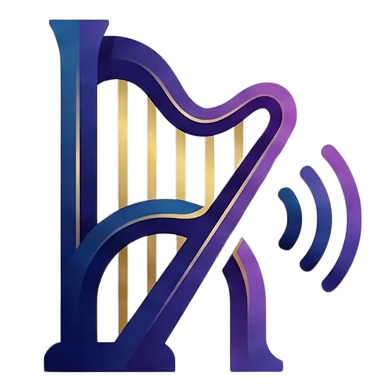

# 🎵 Harp - Modern Music Management & Player

Harp is a premium, feature-rich music management application built with React, TypeScript, and Firebase. It provides a seamless experience for organizing your music library, syncing with Google Drive, and even transcribing lyrics using state-of-the-art AI.




## ✨ Features

- **🚀 High-Performance Player:** Smooth audio playback with support for metadata extraction and synchronized lyrics.
- **☁️ Google Drive Sync:** Connect your Google Drive to store and sync your music library across devices.
- **🤖 AI-Powered Transcription:** Automatically generate lyrics for your songs using OpenAI (GPT-4o) or Google Gemini.
- **📂 Library Management:** Organize songs into playlists, edit metadata, and manage your local/cloud storage.
- **🔄 Audio Converter:** Built-in audio converter powered by FFmpeg (WASM) to ensure compatibility.
- **📱 PWA Ready:** Install Harp on your device for a native-like experience and offline access.
- **🛡️ Secure:** Enterprise-grade security with Firebase App Check and reCAPTCHA protection.

## 🛠️ Tech Stack

### Frontend
- **Framework:** React 19 + Vite
- **Language:** TypeScript
- **Styling:** Tailwind CSS
- **State Management:** React Context API
- **Audio Processing:** @ffmpeg/ffmpeg (WASM), music-metadata-browser
- **Storage:** IndexedDB (via idb-keyval) for local caching

### Backend
- **Platform:** Firebase
- **Authentication:** Firebase Auth (Google Provider)
- **Database:** Cloud Firestore
- **Functions:** Firebase Cloud Functions (v2)
- **Security:** Firebase App Check (reCAPTCHA Enterprise)

### AI & Integrations
- **AI Models:** OpenAI GPT-4o, Google Gemini 2.5 Flash
- **Cloud Storage:** Google Drive API

## 🚀 Getting Started

### Prerequisites
- Node.js (Latest LTS)
- Yarn
- Firebase CLI (`npm install -g firebase-tools`)

### Installation

1. **Clone the repository:**
   ```bash
   git clone https://github.com/your-username/harp.git
   cd harp
   ```

2. **Install dependencies:**
   ```bash
   yarn install
   ```

3. **Environment Setup:**
   Create a `.env.dev` and `.env.prod` file in the root directory.
   ```env
   VITE_FIREBASE_API_KEY=your_api_key
   VITE_FIREBASE_AUTH_DOMAIN=your_project.firebaseapp.com
   VITE_FIREBASE_PROJECT_ID=your_project_id
   VITE_FIREBASE_STORAGE_BUCKET=your_project.appspot.com
   VITE_FIREBASE_MESSAGING_SENDER_ID=your_sender_id
   VITE_FIREBASE_APP_ID=your_app_id
   VITE_RECAPTCHA_ID=your_recaptcha_site_key
   ```

4. **Firebase Functions Setup:**
   Navigate to the `functions` directory and create a `.env` file for secrets.
   ```env
   OPENAI_API_KEY=your_openai_key
   GEMINI_API_KEY=your_gemini_key
   DRIVE_CLIENT_ID=your_google_client_id
   DRIVE_CLIENT_SECRET=your_google_client_secret
   ```

### Running Locally

```bash
# Start Vite development server
yarn dev

# Start Firebase Emulators (optional, for local functions/database testing)
firebase emulators:start
```

## 📂 Project Structure

- `src/` - Frontend application source
  - `components/` - Reusable UI components
  - `context/` - Global state (Auth, Player)
  - `pages/` - Main views (Home, Converter, Library, etc.)
  - `services/` - Business logic (Firebase, Drive, Library services)
  - `types/` - TypeScript interfaces
- `functions/` - Firebase Cloud Functions
- `public/` - Static assets and PWA manifest
- `firestore.rules` - Database security rules

## 📜 License

This project is licensed under the MIT License - see the [LICENSE](LICENSE) file for details.

---

Built with ❤️ by [Hein](https://github.com/HeinSoeHtet)
