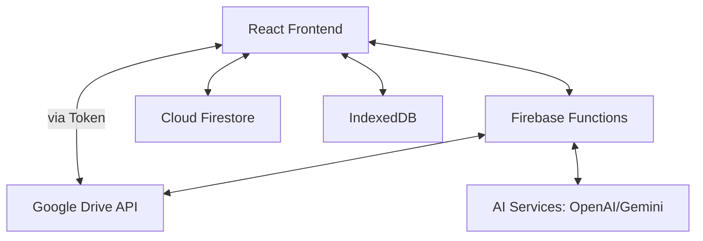

# Harp Architecture

This document describes the high-level architecture of Harp and how its various components interact.

## 1. System Overview

Harp is a hybrid web application that combines local-first principles with cloud synchronization. It uses indexedDB for performance and offline capabilities, while Google Drive and Firebase provide the cloud backend.

## 2. Music Management Workflow

### Local Storage (Library Services)
- Harp uses `idb-keyval` to store audio files and metadata locally.
- When a user uploads a song, it is stored in the browser's IndexedDB.
- Metadata (Artist, Title, Album Art) is extracted using `music-metadata-browser`.

### Cloud Synchronization
- Users can connect their Google Drive account.
- Harp uses an Authorization Code flow to securely obtain a Refresh Token.
- The Refresh Token is stored in Firestore under `user_secrets/{uid}` (only accessible by Cloud Functions).
- Cloud Functions provide temporary Access Tokens to the client upon request.
- The client uses these tokens to interact directly with the Google Drive API for file uploads/downloads.

### Song Hydration
"Hydration" is a core concept in Harp. To save local storage and initial sync time:
1. **Initial Sync:** Only metadata (JSON) is downloaded from Google Drive and stored in IndexedDB.
2. **On Demand Fetch:** When a user plays a song that hasn't been downloaded yet, Harp "hydrates" it by fetching the full binary data from Google Drive using the File ID.
3. **Caching:** Once hydrated, the song is cached in IndexedDB for future offline playback.

## 3. AI Transcription Workflow

1. The client selects an audio file and sends it (as Base64) to the `transcribeSong` Cloud Function.
2. The function validates:
   - Authentication (User must be logged in).
   - App Check (Ensures request comes from the official app).
   - Rate Limits (Max 10 per day per user).
   - File size/duration limits.
3. The function forwards the audio to either OpenAI (GPT-4o) or Google Gemini.
4. The AI returns the transcribed lyrics.
5. The function formats the text into a structured JSON array and returns it to the client.

## 4. State Management

Harp uses a combination of **React Context API** and **Local State** (hooks) to manage global concerns:

- **DriveContext:** Manages authentication, Google Drive tokens, and user session lifecycle.
- **ToastContext:** Provides a unified interface for displaying feedback and errors.
- **App Local State:** The main `App.tsx` manages playback state (queue, current index, shuffle/repeat) to ensure synchronization between the Mini-Player and Full-Player views.

## 5. Audio Processing

Harp uses **FFmpeg.wasm** for client-side audio conversion. This allows users to convert files to compatible formats without high-bandwidth server uploads.

- **Process:**
  1. Load FFmpeg core.
  2. Write input file to virtual FS.
  3. Execute conversion command.
  4. Read output file and return to user.

## 6. Security Model

- **Authentication:** Firebase Auth handles user identity.
- **Data Security:** Firestore rules ensure users can only read/write their own data.
- **API Security:** Firebase App Check protects Cloud Functions from abuse by unauthorized clients.
- **Sensitive Data:** Google Drive Refresh Tokens are stored server-side in Firestore and never exposed to the client.
